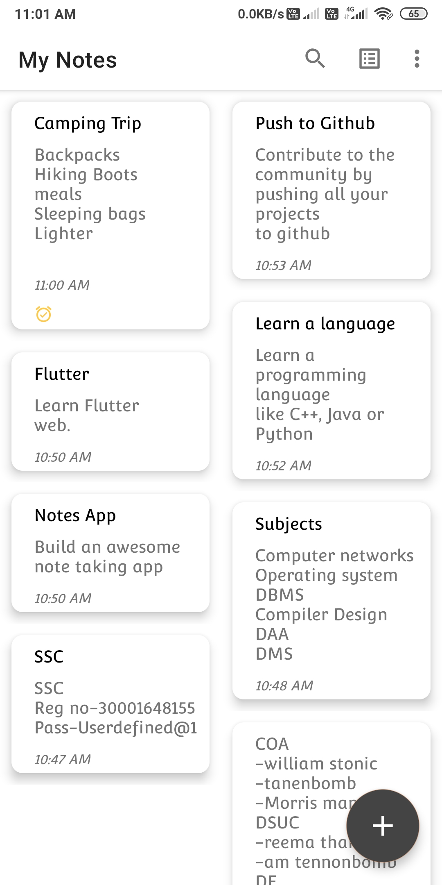
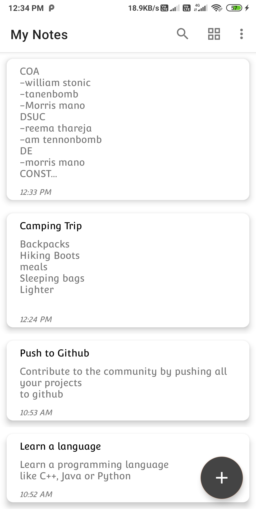
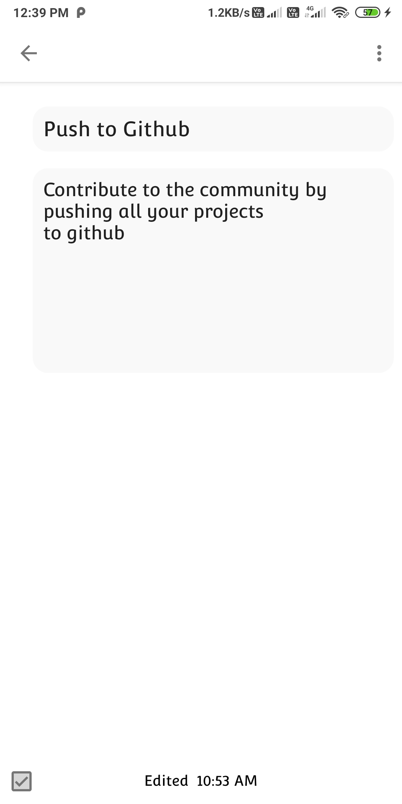
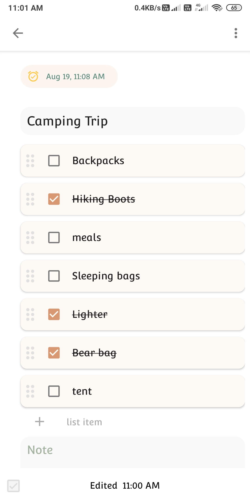
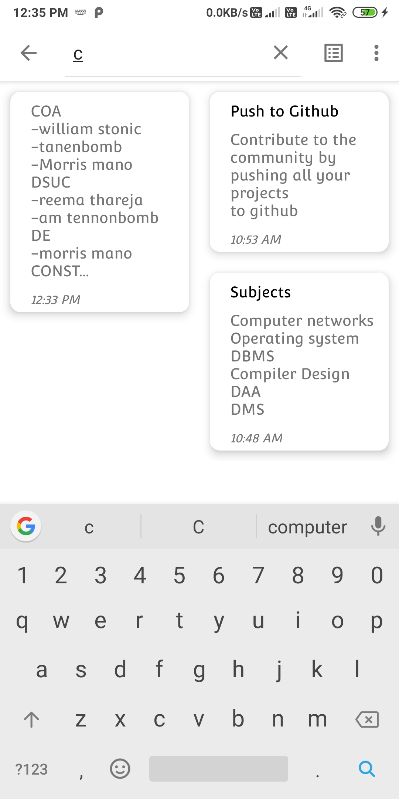
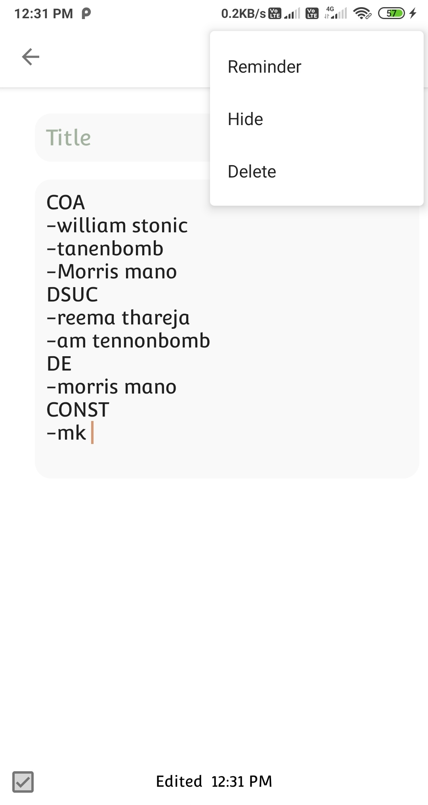
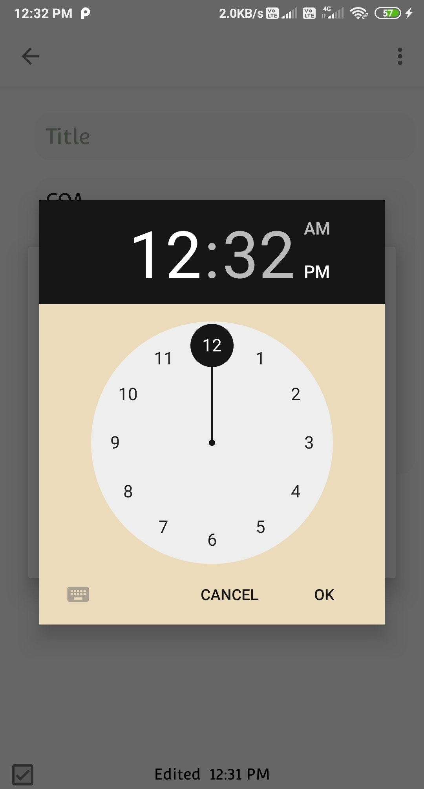
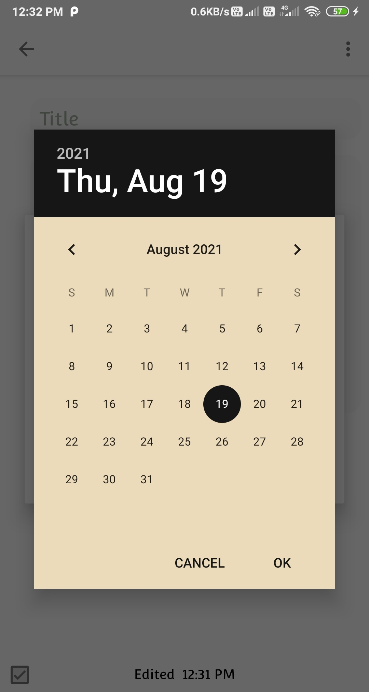
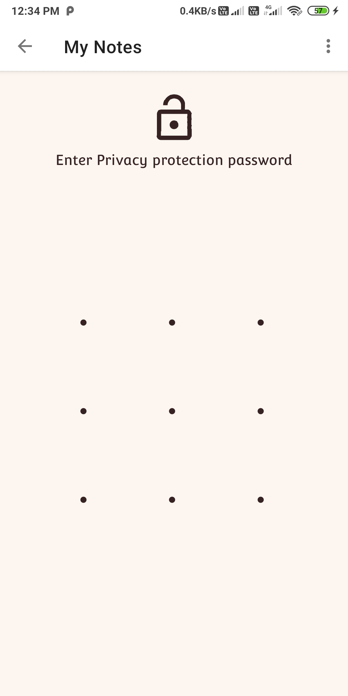
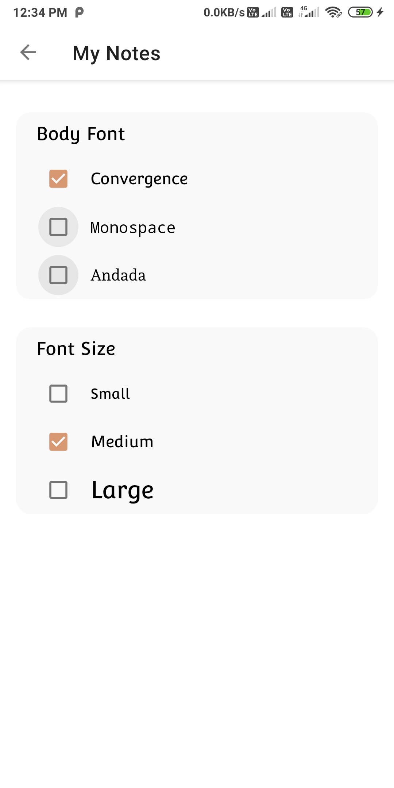

# Notes Keeping App
## Introduction
This project is an android application in which we can store and edit- text notes and todo lists and the data is stored using SQLite database.
## Features
* Easy to use and simple User Interface.
* Create Text notes and Todo lists.
* Add Reminder Alarm.
* Hide your private notes using a pattern lock.
* Change body font and font size.
* Data is stored locally using SQLite database.
## Description
The app can be used to save your daily notes and some todo tasks which can be changed later. It provides you the details of edit time and the latest edited note is show first.
You can create as many notes by clicking on a button which opens up a text editor where you can write a note and also a todo list. The contente of todo list can be checked
, unchecked and cleared. You can hide a normal Note by clicking on the hide button and also unhide a hidden note in the same way.
Important features of the app is that you can add a reminder to any of your saved note which will remind you by sending a notification at the provided time.

## Screenshots

     
     
     
     
     
